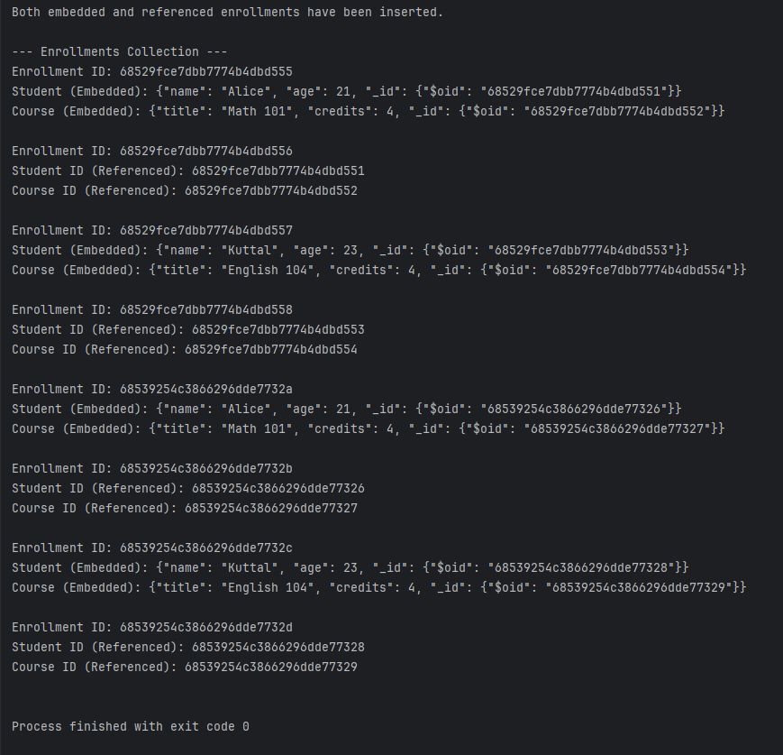

Day3-Task: Student Enrollment Management with MongoDB

This project demonstrates managing student enrollments in courses using **MongoDB**, highlighting the difference between **embedded** and **referenced** document structures.

---

Tech Stack

* **Java**
* **MongoDB (v5.5.1)**
* **MongoDB Java Driver (Sync)**
* **Maven**

---

MongoDB Collections

* `students` — Stores student details
* `courses` — Stores course details
* `enrollments` — Stores enrollment records (both embedded and referenced)

---

Document Structure

* Embedded Enrollment Document

```json
{
  "_id": ObjectId("..."),
  "type": "embedded",
  "student": {
    "studentId": "S001",
    "name": "Alice"
  },
  "course": {
    "courseId": "C101",
    "title": "Data Structures"
  }
}
```

* Referenced Enrollment Document

```json
{
  "_id": ObjectId("..."),
  "type": "referenced",
  "studentId": ObjectId("..."),
  "courseId": ObjectId("...")
}
```

---

Tasks Completed

1. Inserted sample students and courses into the MongoDB collections.
2. Created two types of enrollment records:

   * One using **embedded documents**.
   * Another using **referenced ObjectIds**.
3. Queried and printed both types of enrollment with full student and course details.
4. Updated a student’s name and observed:

   * In **embedded documents**, changes don't auto-propagate.
   * In **referenced documents**, changes are visible wherever they are used.
5. Created **indexes** on `students.name` to optimize search.
6. Captured **screenshots** of terminal results and saved them in the `screenshots/` directory.

---

 How to Build and Run

 Clone the Repository

```bash
git clone https://github.com/Saraswathi-R2003/Day3-Task.git
cd Day3-Task
```

Build the Project

```bash
mvn clean install
```

Run the Application


```bash
mvn exec:java -Dexec.mainClass="MainApp"
```

MongoDB must be running on your system (default: `localhost:27017`).

---


Screenshots from MongoDB Compass

#### Courses Collection


---

#### Students Collection


---

#### Enrollments Collection (Embedded vs Referenced)


---

#### MinApp Output [Console]



 
---

---

Key Learnings

* mbedded documents are fast for reads but can be inconsistent when data is updated.
* Referenced documents  maintain data consistency but require additional joins/lookups.
* Indexing speeds up queries significantly on large collections.

---

Basic Structure

```
Day3-Task/
├── src/
│   └── main/
│       └── java/
│           ├── EnrollmentApp.java
│           ├── Student.java
│           ├── Course.java
│           ├── EnrollmentService.java
├── pom.xml
├── README.md
└── screenshots/
```

Author
**Name**: Saraswathi R

**Registration Number**: 24MSCS28

